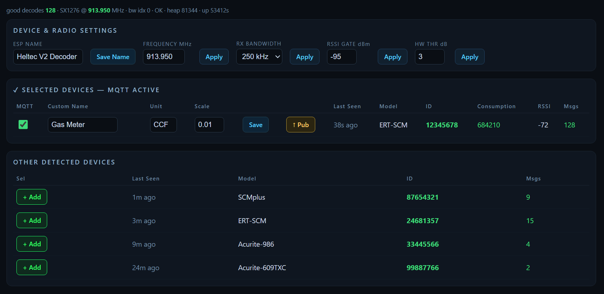

# 📡 Heltec V2 — Itron ERT Meter → Home Assistant

> Turn a **Heltec WiFi LoRa 32 V2** into a 915 MHz **Itron ERT** utility-meter reader
> (gas / water / electric) that streams live consumption into **Home Assistant**.


> 🔗 **Companion project:** want a wider-band receiver that watches the whole ERT band at once?
> See **[ESP32-S3 + CC1101 version →](https://github.com/Xieo/ESP32-S3-CC1101-ERT-Decoder)**



---

## ✨ What it does
- 📶 Decodes **Itron ERT** SCM / SCMplus / IDM meters with [rtl_433](https://github.com/merbanan/rtl_433)
- 🖥️ Clean **web dashboard** to tune the radio and choose which meters to forward
- 🏠 **Home Assistant** auto-discovery over MQTT (gas device class, total-increasing)
- 🔄 **OTA** updates over Wi-Fi, with decode status on the OLED

---

## 🛠️ Requirements
| Item | Notes |
|------|-------|
| Heltec WiFi LoRa 32 V2 | ESP32 + SX1276 (the model with the OLED) |
| 915 MHz antenna | on the **LoRa** u.FL connector |
| MQTT broker + Home Assistant | e.g. the Mosquitto add-on |
| [PlatformIO](https://platformio.org/install) | VS Code extension or CLI |

---

## 🚀 Quick start

**1. Get the code**
```bash
git clone https://github.com/Xieo/Heltec-V2-SX1276-ERT-Decoder.git
cd Heltec-V2-SX1276-ERT-Decoder
```

**2. Configure** — copy the template, then fill in your Wi-Fi + MQTT details:
```bash
cp src/Credentials.h.example src/Credentials.h
```

**3. Apply the one-line RadioLib patch.** After the first build downloads the libraries,
open `.pio/libdeps/heltec-usb/rtl_433_ESP/src/rtl_433_ESP.h` (~line 43) and set:
```c
#define RADIOLIB_LOW_LEVEL (1)
```
Re-apply this after any clean rebuild; without it the build fails with `operator '!' has no right operand`.

**4. Flash over USB**
```bash
pio run -e heltec-usb -t upload
```

**5. Open `http://<board-ip>/`** (the OLED shows the IP), find your meter under
**Other Detected Devices**, and click **➕ Add** — it now appears in Home Assistant.

> **Wi-Fi updates:** set your board's IP under `[env:heltec-wifi]` in `platformio.ini`, then
> `pio run -e heltec-wifi -t upload`.

---

## 🎛️ Dashboard
| Control | Purpose |
|---------|---------|
| **Frequency / RX Bandwidth** | Park the 250 kHz window on your meter's channel. The SX1276 OOK bandwidth maxes at 250 kHz, so it must sit on the carrier. |
| **Other Detected Devices** | Everything currently on the air — **➕ Add** to track one. |
| **Selected Devices** | Tracked meters: set a **name / unit / scale**, **Save**, or **Pub** to push the latest reading immediately. |

Tracked meters auto-publish on every decode and appear in Home Assistant as a device with a
**consumption** sensor and an **RSSI** diagnostic sensor.

---

## 🙏 Credits
[rtl_433](https://github.com/merbanan/rtl_433) · [Entropy512/rtl_433_ESP](https://github.com/Entropy512/rtl_433_ESP) (`neptune_r900`) · [RadioLib](https://github.com/jgromes/RadioLib)

> Read only meters you are authorized to. ERT is unencrypted utility telemetry — check your local rules.
